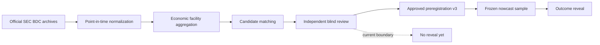

# Finance Research Showdown

An evidence-first research repository testing whether public filings contain a
reproducible information advantage before anyone builds a product around it.

Подробный русскоязычный журнал всей работы:

[`docs/research/PROJECT_HISTORY_RU.md`](docs/research/PROJECT_HISTORY_RU.md)

> **Current boundary — 14 August 2026:** Day 3 measurement repair is complete.
> No new outcome reveal, target-error calculation, results tag, or flagship
> selection is authorized. The next step is independent blind review.

## The two research tracks

| Track | Research question | Current status |
|---|---|---|
| **ShadowNAV** | Can an early-reporting BDC's mark on the exact same private-credit facility improve the nowcast of a later listed BDC's still-unpublished mark? | **Pre-reveal candidate.** The repaired pipeline finds 37 untouched, cross-manager movement facilities. Blind matching review and preregistration v3 approval are still required. |
| **Japanese Language Wall** | Do Japanese earnings-forecast revisions drift differently when English disclosure is absent or delayed? | **Demoted to a prospective live-data product under current constraints.** Historical indexing works, but no scalable old/new numeric recovery path was demonstrated within the current access and budget limits. |

This is a research record, not a trading strategy or investment advice. A
planning-power count is not evidence of predictive accuracy.

## Why this repository exists

The project deliberately separates four things that are often mixed together:

1. data availability;
2. measurement validity;
3. preregistered prediction;
4. product or trading usefulness.

Day 2 produced a useful failed exploratory pilot: the attractive adjusted
result was driven entirely by one borrower, PetVet, and the initial matching
benchmark was circular. Day 3 repaired the unit of analysis, extended the
reporting calendar, audited official SEC field lineage, and prepared a genuinely
blind facility benchmark. Those repairs happened **before** any new reveal.



## Current evidence snapshot

- Reporting order: **152/152** fund-period rows verified for 19 BDCs across
  2023Q4–2025Q3; 64 scheduling announcements were excluded.
- Pre-reveal eligibility: **37** untouched independent movement facilities,
  all in the cross-manager stratum, above the planning guard of 20.
- Main bottleneck: the limited 19-fund universe, responsible for about **49.8%**
  of first-stage losses; weak XBRL facility tagging is second.
- Expansion screen: 186 BDC CIKs appear in the eight official archives, but no
  additional fund has been admitted to the working sample.
- Japan frozen sample: TDnet documents **0/20**, Wayback **0/20**; issuer IR was
  not executed at scale and J-Quants was blocked from the researcher region.

The exact interpretation and caveats live in
[`docs/research/DAY3_FINAL_PRE_REVEAL.md`](docs/research/DAY3_FINAL_PRE_REVEAL.md)
and
[`docs/research/FIELD_LINEAGE_AND_MANAGER_AUDIT.md`](docs/research/FIELD_LINEAGE_AND_MANAGER_AUDIT.md).

## Independent reviewer handoff

Only these two public files are current for clean reviewers:

| Review | File | Rows | SHA-256 |
|---|---|---:|---|
| Facility identity | [`data/day3/blind_facility_pairs_v3.csv`](data/day3/blind_facility_pairs_v3.csv) | 120 | `f4ec256bf4502f5cb6979ff218d3b5457481f0ae21bdb75841d4bb3c1d357c2b` |
| Borrower alias recall | [`data/day3/blind_alias_candidates.csv`](data/day3/blind_alias_candidates.csv) | 128 | `d37f5daeb4eb6cee9e4ddb2e7690978a6ac899c30305b4fda268bb7424a8b64e` |

Do not use `blind_facility_pairs.csv`, `blind_facility_pairs_v2.csv`, or
`blind_match_sample.csv` for new reviews. They are retained only for audit
history. See the
[`reviewer guide`](docs/research/REVIEWER_GUIDE.md) and the canonical
[`readiness decision`](docs/research/BLIND_BENCHMARK_READINESS.md).

Private mapping keys are intentionally ignored by Git and must never be shared
with reviewers.

## Repository map

| Path | Purpose |
|---|---|
| [`00_project/`](00_project/) | Project framing and pitch language |
| [`01_memos/`](01_memos/) | Early hypothesis memos and rejected ideas |
| [`02_showdown/`](02_showdown/) | Day 1 scripts, outputs, tracker, and original preregistration |
| [`03_reference/`](03_reference/) | Methodology and source notes |
| [`docs/research/`](docs/research/) | Canonical findings, audits, preregistrations, and historical record |
| [`scripts/`](scripts/) | Deterministic Day 2 and corrected Day 3 pipelines |
| [`data/`](data/) | Small, provenance-aware research outputs; no raw SEC ZIPs or bulk API dumps |
| [`tests/`](tests/) | Regression, lineage, freeze-boundary, and generated-output checks |
| [`artifacts/`](artifacts/) | Reconciled workbooks and compact presentation artifacts |

More detailed indexes are available in
[`docs/research/README.md`](docs/research/README.md),
[`data/README.md`](data/README.md), and
[`scripts/README.md`](scripts/README.md).

## Canonical reading order

1. [`docs/research/DAY3_FINAL_PRE_REVEAL.md`](docs/research/DAY3_FINAL_PRE_REVEAL.md)
2. [`docs/research/PROJECT_HISTORY_RU.md`](docs/research/PROJECT_HISTORY_RU.md) — подробная история работы и решений
3. [`docs/research/FIELD_LINEAGE_AND_MANAGER_AUDIT.md`](docs/research/FIELD_LINEAGE_AND_MANAGER_AUDIT.md)
4. [`docs/research/BLIND_BENCHMARK_READINESS.md`](docs/research/BLIND_BENCHMARK_READINESS.md)
5. [`docs/research/PREREGISTRATION_V3_DRAFT.md`](docs/research/PREREGISTRATION_V3_DRAFT.md) — draft only, not approval
6. [`docs/research/01_DAY1_CANONICAL_FINDINGS.md`](docs/research/01_DAY1_CANONICAL_FINDINGS.md)
7. [`docs/research/DAY2_RESULTS.md`](docs/research/DAY2_RESULTS.md) — failed exploratory pilot, preserved as evidence

Files under `docs/research/history/` are archival snapshots and are never the
current source of truth.

## Reproduce the checks

Python 3.11+ is recommended.

```bash
python3 -m venv .venv
source .venv/bin/activate
python -m pip install -r requirements-dev.txt
python -m pytest -q
python -m compileall -q 02_showdown scripts tests
```

Networked SEC scripts require a descriptive fair-access user agent. Copy the
example values into your shell or an untracked `.env`; never commit real contact
details or API keys.

```bash
export SEC_USER_AGENT="ShadowNAV research your-name@example.com"
```

Raw SEC ZIPs, scraped pages, bulk J-Quants responses, credentials, and private
blind keys are deliberately excluded from Git. Only compact manifests, hashes,
normalized sample outputs, and research documentation belong here.

## Frozen research history

| Milestone | Branch | Tag |
|---|---|---|
| Day 1 reconciled showdown | `research/day1-showdown-reconciled` | `showdown-day1-reconciled-2026-08-12` |
| Day 2 mechanism pilot | `research/day2-mechanism-pilot` | `showdown-day2-mechanism-2026-08-13` |
| Day 3 measurement repair | `research/day3-measurement-repair` | No results tag — intentionally |

The Day 1 and Day 2 tags are immutable checkpoints. Day 3 remains pre-reveal.

<details>
<summary><strong>Кратко по-русски</strong></summary>

Репозиторий проверяет две финансовые гипотезы на реальных данных. Основной
кандидат ShadowNAV использует более раннюю оценку одного и того же кредитного
facility у одного BDC для nowcast ещё не опубликованной оценки другого BDC.
После исправления измерительного слоя новый результат пока не раскрывался:
сначала нужны независимая слепая разметка и утверждённая preregistration v3.
Японский исторический трек понижен до идеи live-data продукта при текущих
ограничениях доступа, но собранный индекс событий сохранён.

</details>
